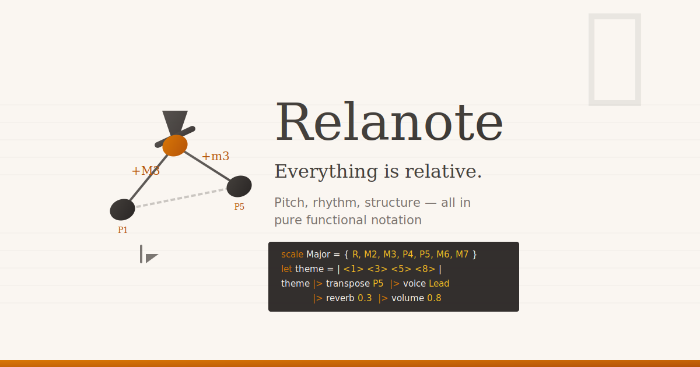

<p align="center">
  
</p>

<p align="center">
  <a href="https://github.com/ubugeeei/relanote/actions"></a>
  <a href="https://github.com/ubugeeei/relanote/blob/main/LICENSE"></a>
</p>

<p align="center">
  <a href="#features">Features</a> •
  <a href="#quick-start">Quick Start</a> •
  <a href="#example">Example</a> •
  <a href="#documentation">Documentation</a> •
  <a href="#playground">Playground</a>
</p>

---

## What is Relanote?

Relanote is a programming language designed for describing music using **relative intervals** rather than absolute pitches. Built with functional programming principles and static typing, it makes musical transformations like transposition, modulation, and composition natural and type-safe.

```rela
; Define a major scale using intervals
scale Major = { R, M2, M3, P4, P5, M6, M7 }

; Create a melody using scale degrees
let melody = | <1> <3> <5> <3> <1> |

; Transform with builtins
let transformed = melody |> repeat 2

transformed
```

## Features

- **🎵 Relative Intervals** - Describe melodies using intervals (M3, P5, m7) instead of absolute pitches
- **λ Pure Functional** - Immutable values, first-class functions, and composable transformations
- **🔒 Static Typing** - Hindley-Milner type inference catches errors at compile time
- **🎼 Compositional** - Build complex pieces from simple building blocks
- **🎹 MIDI Export** - Render compositions to standard MIDI files
- **🌐 Web Playground** - Try Relanote in your browser with live preview

## Quick Start

### Using mise (Recommended)

```bash
# Clone the repository
git clone https://github.com/ubugeeei/relanote.git
cd relanote

# Trust and setup
mise trust
mise run setup

# Start the web playground
mise run dev
```

### Manual Installation

```bash
# Build the CLI
cargo build --release

# Run a file
./target/release/relanote run examples/hello.rela

# Render to MIDI
./target/release/relanote render examples/hello.rela -o output.mid
```

## Example

### Simple Melody

```rela
scale Major = { R, M2, M3, P4, P5, M6, M7 }

; Twinkle Twinkle Little Star
let twinkle = | <1> <1> <5> <5> <6> <6> <5> - <4> <4> <3> <3> <2> <2> <1> - |

twinkle
```

### Chord Progression

```rela
scale Major = { R, M2, M3, P4, P5, M6, M7 }

; Major triad chord
chord Tonic = [ R, M3, P5 ]

; Simple progression
let progression = | <1> <4> <5> <1> |

progression
```

### Transformations

```rela
scale Major = { R, M2, M3, P4, P5, M6, M7 }

let melody = | <1> <2> <3> <4> |

; Repeat the melody
let repeated = melody |> repeat 2

; Reverse the melody
let reversed = melody |> reverse

; Transpose up a fifth
let higher = melody |> transpose P5

repeated
```

## Documentation

- [Introduction](docs/guide/introduction.md) - What is Relanote?
- [Installation](docs/guide/installation.md) - Setup guide
- [Quick Start](docs/guide/quick-start.md) - Your first program
- [Tutorial](docs/tutorial/getting-started.md) - Step-by-step guide

### Language Reference

- [Intervals](docs/guide/intervals.md) - P1, M3, P5, m7...
- [Scales & Chords](docs/guide/scales-and-chords.md)
- [Blocks](docs/guide/blocks.md) - Note sequences
- [Pipes & Composition](docs/guide/pipes.md)

## Playground

Try Relanote in your browser at [ubugeeei.github.io/relanote/playground](https://ubugeeei.github.io/relanote/playground/)

Features:
- Monaco editor with syntax highlighting
- Real-time error checking
- Staff notation preview
- Audio playback
- MIDI export

## Project Structure

```
relanote/
├── crates/
│   ├── relanote_core/      # Shared types, spans, diagnostics
│   ├── relanote_lexer/     # Tokenizer (logos)
│   ├── relanote_ast/       # AST definitions
│   ├── relanote_parser/    # Parser (chumsky)
│   ├── relanote_hir/       # High-level IR
│   ├── relanote_resolver/  # Name resolution
│   ├── relanote_types/     # Type system (Hindley-Milner)
│   ├── relanote_eval/      # Evaluator
│   ├── relanote_stdlib/    # Standard library
│   ├── relanote_format/    # Code formatter
│   ├── relanote_lsp/       # Language Server Protocol
│   ├── relanote_render/    # MIDI rendering
│   ├── relanote_cli/       # CLI tool
│   └── relanote_wasm/      # WebAssembly bindings
├── web/                    # Nuxt web playground
├── docs/                   # VitePress documentation
└── examples/               # Example files
```

## Development

```bash
# Run tests
mise run test

# Run lints
mise run lint

# Format code
mise run fmt

# Build WASM
mise run wasm:build

# Start docs dev server
mise run docs:dev
```

## Contributing

Contributions are welcome! Please read our contributing guidelines before submitting PRs.

## License

MIT License - see [LICENSE](LICENSE) for details.

---

<p align="center">
  Made with ♪ by <a href="https://github.com/ubugeeei">ubugeeei</a>
</p>
