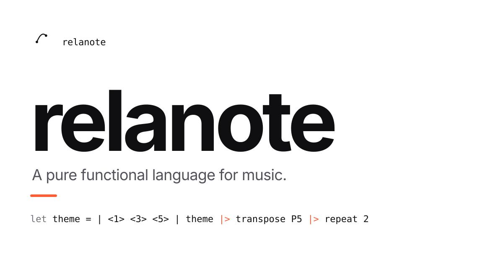

<p align="center">
  
</p>

<p align="center">
  <a href="https://github.com/ubugeeei/relanote/actions"></a>
  <a href="https://github.com/ubugeeei/relanote/blob/main/LICENSE"></a>
</p>

<p align="center">
  <a href="#what-is-relanote">What</a> •
  <a href="#example">Example</a> •
  <a href="#quick-start">Quick start</a> •
  <a href="#playground">Playground</a> •
  <a href="#documentation">Docs</a>
</p>

---

## What is relanote?

**relanote** is a pure functional, statically-typed language for music
where **everything is relative**. Pitch is relative — a melody is
scale-degree references, not absolute pitches. Rhythm is relative — a
block divides one slot equally among the notes inside it. Chords are
intervals over a root, sections are blocks over a beat-grid, parts are
sections over an instrument, layers are parts over time. Change the
key, the scale or the tempo, and the *shape* doesn't change. That's the
whole point.

```rela
; A scale is the seven intervals that define it.
scale Major = { R, M2, M3, P4, P5, M6, M7 }

; A melody is scale-degree references. <1> is the root,
; <3> is the third, <5> is the fifth — of whatever scale is in scope.
let theme = | <1> <3> <5> <3> <1> |

; Compose the same way you'd compose code.
theme |> transpose P5 |> repeat 2
```

## Features

- **Pitch is relative.** `<1> <3> <5>` works in every key, every mode,
  every scale. Transpose, modulate or reshape without rewriting a single
  pitch.
- **Rhythm is relative.** `| a b c d |` shares its slot equally among
  four notes; `| a b |` gives two notes the same slot at half the
  density. Tempo and meter don't change the shape.
- **Pure, typed, total.** Immutable values, first-class functions, and
  Hindley-Milner inference. No runtime surprises.
- **Pipes for composition.** `theme |> transpose P5 |> repeat 2 |> reverb 0.3` —
  build pieces by composing small functions.
- **MIDI out, web in.** Render to a standard MIDI file or drive the live
  playground directly in the browser. No DAW round-trips.

## Quick Start

### Using mise (Recommended)

```bash
# Clone the repository
git clone https://github.com/ubugeeei/relanote.git
cd relanote

# Trust and setup
mise trust
mise run setup

# Start the web playground
mise run dev
```

### Manual Installation

```bash
# Build the CLI
cargo build --release

# Run a file
./target/release/relanote run examples/hello.rela

# Render to MIDI
./target/release/relanote render examples/hello.rela -o output.mid
```

## Example

### Simple Melody

```rela
scale Major = { R, M2, M3, P4, P5, M6, M7 }

; Twinkle Twinkle Little Star
let twinkle = | <1> <1> <5> <5> <6> <6> <5> - <4> <4> <3> <3> <2> <2> <1> - |

twinkle
```

### Chord Progression

```rela
scale Major = { R, M2, M3, P4, P5, M6, M7 }

; Major triad chord
chord Tonic = [ R, M3, P5 ]

; Simple progression
let progression = | <1> <4> <5> <1> |

progression
```

### Transformations

```rela
scale Major = { R, M2, M3, P4, P5, M6, M7 }

let melody = | <1> <2> <3> <4> |

; Repeat the melody
let repeated = melody |> repeat 2

; Reverse the melody
let reversed = melody |> reverse

; Transpose up a fifth
let higher = melody |> transpose P5

repeated
```

## Documentation

- [Introduction](docs/guide/introduction.md) - What is Relanote?
- [Installation](docs/guide/installation.md) - Setup guide
- [Quick Start](docs/guide/quick-start.md) - Your first program
- [Tutorial](docs/tutorial/getting-started.md) - Step-by-step guide

### Language Reference

- [Intervals](docs/guide/intervals.md) - P1, M3, P5, m7...
- [Scales & Chords](docs/guide/scales-and-chords.md)
- [Blocks](docs/guide/blocks.md) - Note sequences
- [Pipes & Composition](docs/guide/pipes.md)

## Playground

Try Relanote in your browser at [ubugeeei.github.io/relanote/playground](https://ubugeeei.github.io/relanote/playground/)

Features:
- Monaco editor with syntax highlighting
- Real-time error checking
- Staff notation preview
- Audio playback
- MIDI export

## Project Structure

```
relanote/
├── crates/                  # Rust implementation (current source of truth)
│   ├── relanote_core/       # Shared types, spans, diagnostics
│   ├── relanote_lexer/      # Tokenizer (logos)
│   ├── relanote_ast/        # AST definitions
│   ├── relanote_parser/     # Parser (chumsky)
│   ├── relanote_hir/        # High-level IR
│   ├── relanote_resolver/   # Name resolution
│   ├── relanote_types/      # Type system (Hindley-Milner)
│   ├── relanote_eval/       # Evaluator
│   ├── relanote_stdlib/     # Standard library
│   ├── relanote_format/     # Code formatter
│   ├── relanote_lsp/        # Language Server Protocol
│   ├── relanote_render/     # MIDI rendering
│   ├── relanote_cli/        # CLI tool
│   └── relanote_wasm/       # WebAssembly bindings
├── moonbit/                 # MoonBit port (in progress)
│   ├── relanote_core/       # ← mirrors crates/relanote_core
│   └── relanote_lexer/      # ← mirrors crates/relanote_lexer
├── web/                     # Nuxt web playground
├── docs/                    # VitePress documentation
└── examples/                # Example files
```

## Rewrite roadmap

Relanote is being incrementally rewritten in [MoonBit](https://www.moonbitlang.com/),
with [Vapor Moon](https://github.com/moonbitlang/vapor-moon) eventually
replacing the Nuxt playground. The Rust + Nuxt stack stays the source of
truth while the rewrite lands.

| Crate                   | MoonBit package                         | Status |
| ----------------------- | --------------------------------------- | :----: |
| `relanote_core`         | `moonbit/relanote_core`                 | ✅     |
| `relanote_lexer`        | `moonbit/relanote_lexer`                | ✅     |
| `relanote_ast`          | `moonbit/relanote_ast`                  | ✅     |
| `relanote_parser`       | `moonbit/relanote_parser`               | 🟡     |
| `relanote_hir`          | `moonbit/relanote_hir`                  | ✅     |
| `relanote_resolver`     | `moonbit/relanote_resolver`             | ⏳     |
| `relanote_types`        | `moonbit/relanote_types`                | 🟡     |
| `relanote_eval`         | `moonbit/relanote_eval`                 | ⏳     |
| `relanote_stdlib`       | `moonbit/relanote_stdlib`               | ✅     |
| `relanote_format`       | `moonbit/relanote_format`               | ⏳     |
| `relanote_lsp`          | `moonbit/relanote_lsp`                  | ⏳     |
| `relanote_render`       | `moonbit/relanote_render`               | ⏳     |
| `relanote_cli`           | `moonbit/cmd/relanote`                  | ⏳     |
| `relanote_wasm` + `web` | `moonbit/web` (Vapor Moon)              | ⏳     |

## Development

```bash
# Run tests
mise run test

# Run lints
mise run lint

# Format code
mise run fmt

# Build WASM
mise run wasm:build

# Start docs dev server
mise run docs:dev
```

## Contributing

Contributions are welcome! Please read our contributing guidelines before submitting PRs.

## License

MIT License - see [LICENSE](LICENSE) for details.

---

<p align="center">
  Made with ♪ by <a href="https://github.com/ubugeeei">ubugeeei</a>
</p>
